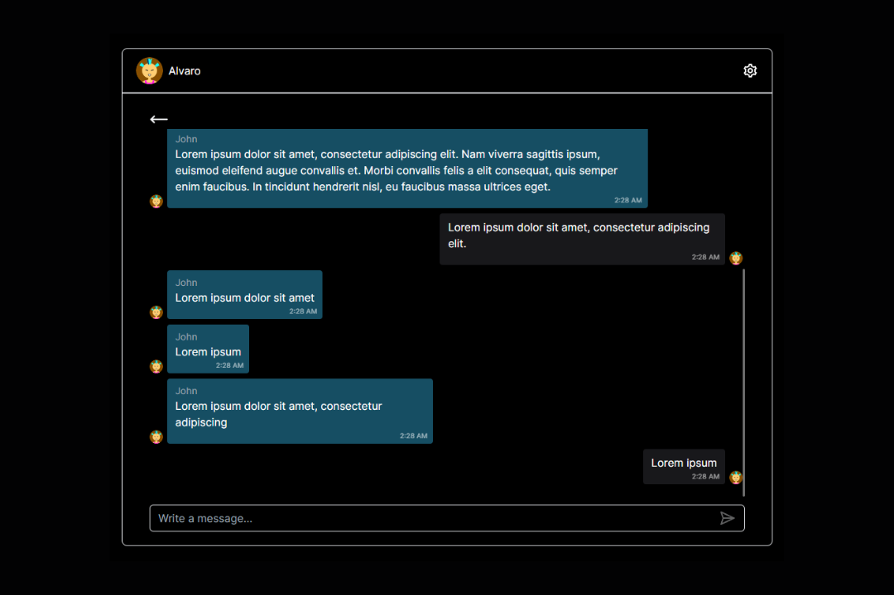

<div align="center">
    <h1>Real-Time Chat</h1>
    
</div>

## ℹ About The Project
Real-time chat web using [NodeJS](https://nodejs.org/), [Express](https://expressjs.com/) and [Socket.IO](https://socket.io/) on the backend, and [Next.JS](https://nextjs.org/) with [Tailwind CSS](https://tailwindcss.com/) on the frontend. This project enables instant messaging and supports features like chat rooms.

## 📜 Getting Started
### 1. Clone the repo
```
git clone https://github.com/alvarovalverde03/websockets-chat.git

cd websockets-chat
```

### 2. Setup Backend
```
cd ./backend

npm install

npm run dev
```


### 1. Setup Frontend
```
cd ./frontend

npm install

npm run dev
```

## 🤝 Contributing
Feel free to open issues or submit pull requests!